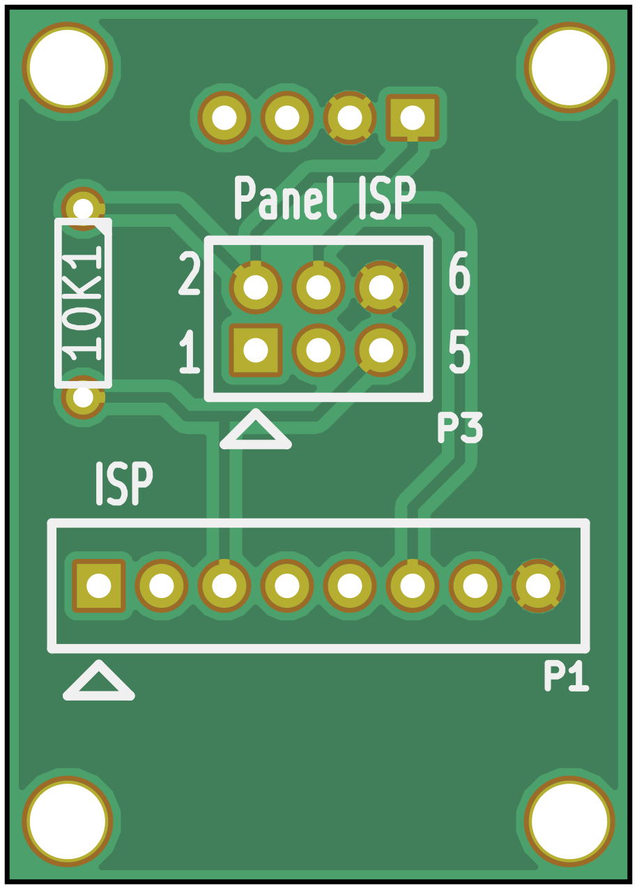
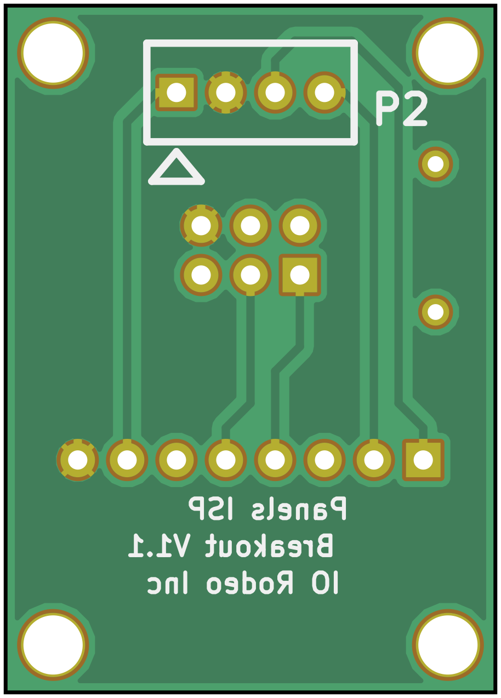

# ISP Breakout

{:.ifr .pop}
{:.ifr .pop .clear}

This is an additional PCB for the Controller which adds an ISP interface to the [Controller]({{site.baseurl}}/Generation%203/Controller/docs/g3_controller.html) as well as the possibility to directly interact with a [panel]({{site.baseurl}}/Generation%203/Hardware/docs/panel.html). For technical details have a look at the preview of the [schematics](assets/panels_isp_breakout.pdf).

## Parts list
{:.clear}

| Part      |    Description              |    Vendors |
|:---------:|:----------------------------|:-----------|
| P1        | 8pin receptacle 0.1"        | Digi-Key SAM1222-08-ND |
| P2        | friction lock header 0.1"   | Digi-Key A1922-ND |
| P3        | 3x2 male header 0.1"        | Digi-Key WM8121-ND |
| R         | resistor 10k, 1/4W 5%       | Digi-Key P10KBACT-ND |
